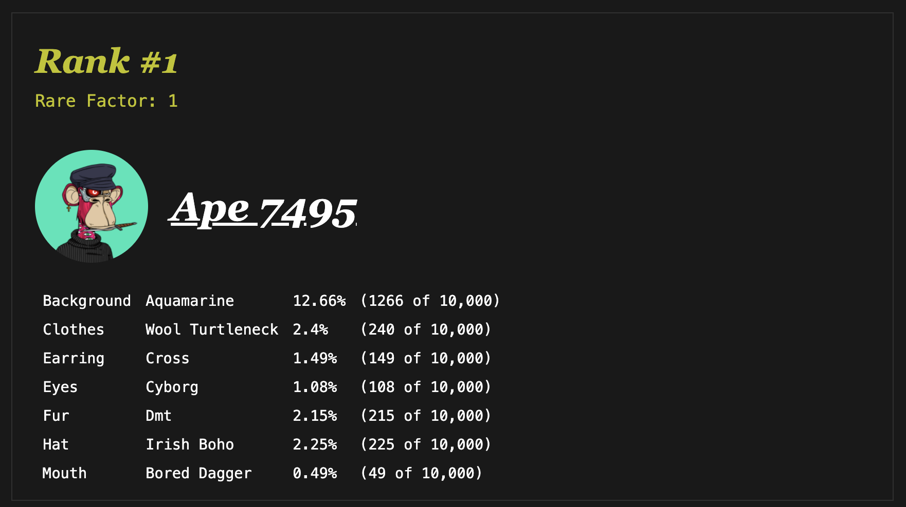

# ApeRank

> How rare are you, ape?

Rank Bored Apes by rare factor, powered by [Apebase](https://ape.offbase.org).



# How it works

ApeRank ranks [Bored Ape Yacht Club](https://boredapeyachtclub.com/) apes based on their metadata attributes. More specifically, based on how their attributes are.

It's powered by [Apebase](https://ape.offbase.org).

# Rank Algorithm

> NOTICE: This project is an experiment. If you find an error in the algorithm, please open an issue: https://github.com/skogard/aperank/issues

Here are the number of apes that have each attribute:

```
{
  Mouth: 10000,
  Background: 10000,
  Hat: 7744,
  Eyes: 10000,
  Clothes: 8114,
  Fur: 10000,
  Earring: 2977
}
```


For example, there are `2977` apes with earrings, and `8114` apes with clothes, etc.

## 1. Data cleansing

One notable thing is:

1. Not all apes have hats: 7744 apes have hats. The rest don't have hats.
2. Not all apes have clothes: 8114 have clothes on. The rest are naked.
3. Not all apes have earrings: Only 2977 have earrings

To calculate the rare factor, we shall include the "lack of attribute" also as an attribute.

For example, the 1886 apes that don't have clothes on (10000-8114) are considered to have the "Clothes" of `none`


## 2. Calculate Rare Factor

Once we normalize the attributes, each ape ends up with the following attributes:

```
{
  Mouth: <Mouth attribute>,
  Background: <Background attribute>,
  Hat: <Hat attribute>|none,
  Eyes: <Eyes attribute>,
  Clothes: <Clothes attribute>|none,
  Fur: <Fur attribute>,
  Earring: <Earring attribute>|none
}
```

Note that only the `Hat`, `Clothes`, and `Earring` attributes have the `none` option.

Then we calculate the rare factor by:

1. Count how many times each attribute occurs
2. Divide the count by the total attribute count to get the ratio
3. Each ape has multiple attributes, we can assign ratio to each attribute
4. Calculate the total rare factor by multiplying all attribute ratio for each ape.
5. Rank the apes based on the rare factor


# Run it yourself

This repository contains the code that generates the static HTML file. To run it yourself, first clone it:

```
git clone https://github.com/skogard/aperank.git
```

Then install dependencies:

```
npm install
```

Build the rank database:

```
npm run build
```

and finally run the web app:

```
npm start
```

You can open the web app at http://localhost:3011
